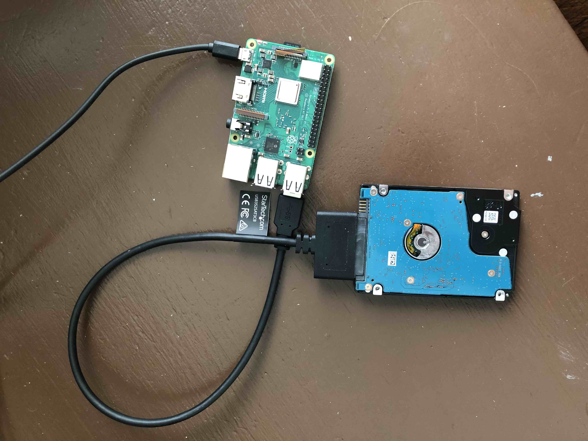
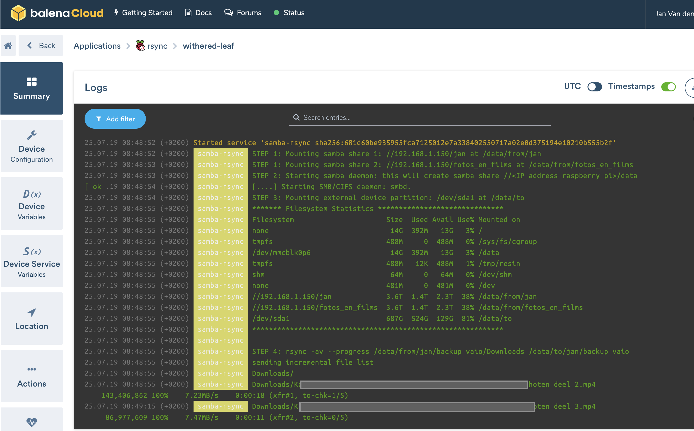
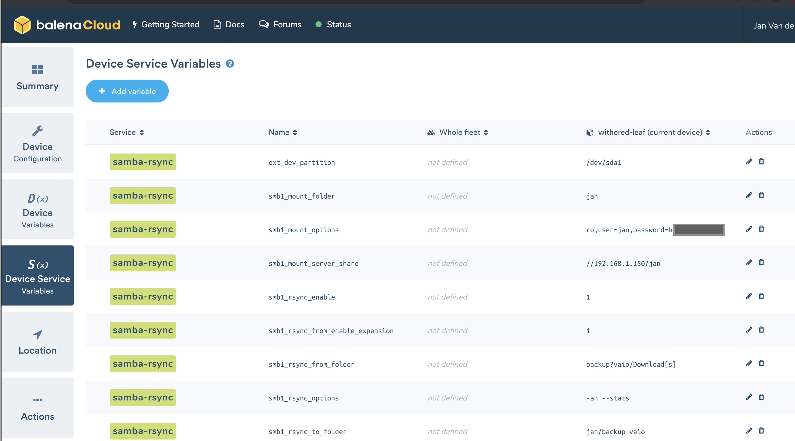

# Balena "samba-rsync" Application

This is a [Balena](https://www.balena.io/) application consisting of a single docker container "`samba-rsync`"
which allows to take backups of windows shares ([samba](https://en.wikipedia.org/wiki/Samba_(software))) to an external harddisk using [rsync](https://en.wikipedia.org/wiki/Rsync).





## Rationale for this Application

The idea is to use harddisks recuperated from old laptops and desktops as backup storage for my extensive photo and video collection (and other data).  Once the backup is taken, I plan to unplug those harddisks and get them safely stored at a different location (not in the same house).

## Features

1. make it easy to format a harddisk connected to a USB port of a raspberry pi (or other balena compatible device) in the ext4 format ([ext4](https://en.wikipedia.org/wiki/Ext4) = popular filesystem format for linux systems)
2. mount this harddisk (ext4 partition) so that the raspberry pi can write to it.
3. create a windows share (samba) so that I can read the contents written to this harddisk from my laptop by simply mounting this windows share on my laptop.
4. mount on the raspberry pi the external windows share holding my photo/video collection as read only.
5. take a backup of specific folders from the windows share (see point 4) to the mounted harddisk (see step 2) using [rsync](https://en.wikipedia.org/wiki/Rsync).

## Hardware needed besides a raspberry pi

1. harddisk(s) with sufficient space for the backup
2. cable to connect harddisk to one of the USB ports of the raspberry pi (I have used a SATA to USB cable for my 3.5 inch SATA disks)
3. Assure that you are harddisk is sufficiently powered (for most 3.5 inch harddisk the power provided by the raspberry pi USB port is sufficient so you don't need an external power source)

## Folder Structure of the samba-rsync service

* `/data` : is a [named volume](https://www.balena.io/docs/learn/develop/multicontainer/#named-volumes).  This folder is also accessible as windows share at `smb://<IP address of the raspberry pi>/data` (user = guest) !!
  * `to/` : location where the external harddisk partition is mounted to.
  * `from/`: folder where we will mount the external samba shares having the files to backup.
    * `smb1/` (or `${smb1_mount_folder}/`) : location where the first external samba share is mounted to.
    * `smb2/` (or `${smb2_mount_folder}/`) : location where the second external samba share is mounted to.

## SETUP INSTRUCTIONS

### 1. Deploy Balena application

So as you might have guessed this is indeed a balena application.  So follow all standard instructions for setting up and deploying this balena application. (e.g. see [getting started raspberry pi example](https://www.balena.io/docs/learn/getting-started/raspberrypi3/nodejs/))

After this step: this balena application should be running on your raspberry pi.

### 2. Format the harddisk (partition) in ext4 format

If your hard disk is not yet properly formatted in ext4 format then:

1. connect the harddisk to one of the USB ports.  
2. Open in your balenacloud dashboard a terminal window for the `samba-rsync` container and execute the following steps:
3. Create one partition on the hard disk using the `fdisk`command.  For more information see [here](https://www.2daygeek.com/linux-fdisk-command-to-manage-disk-partitions/)
4. Format the partition in ext4 format using the command `mkfs.ext4` (e.g. `mkfs.ext4 /dev/sda1`)
5. Optionally you can give the partition a meaningful label using the command : `e2label` (e.g. `e2label /dev/sda1 hd01_ext4_700G`)

### 3. Set Device Service Variables for the samba-rsync container

Within your balenacloud dashboard you must set the following device service variables for the `samba-rsync` container.

#### 3.1 specify external harddisk to mount

| Service Variable         | Description                                  |
|------------------------- | ---------------------------------------------|
| **ext_dev_partition**    |  This is the linux device name of the ext4 partition created in step 2 (E.g. `/dev/sda1` ).  Note that this is the partition where all the files will be written to by the rsync command (see further).  This partition will be mounted to folder `\data\to`. |

#### 3.2 specify the remote samba share to mount

| Service Variable         | Description                                  |
|------------------------- | ---------------------------------------------|
| **smb1_mount_server**    | samba share location (e.g. `//192.168.1.150/photos`) containing the data that must be backed up. |
| **smb1_mount_options**   | Mounting options for the samba share (e.g. `ro,guest` or `ro,user=john,password=XXXXXXX` where `ro` stands for `read only`) |
| **smb1_mount_folder**    | Specifies the folder under `/data/from/` where the share should be mounted to.  If this option is not specified then the share will be mounted to `/data/from/smb1`|
| **smb2_mount_....** | It is possible to specify a second remote samba share.  In that case the service variables start with `smb2_` instead of `smb1_`|

### 3.3 specify the rsync settings

| Service Variable         | Description                                  |
|------------------------- | ---------------------------------------------|
| **smb1_rsync_enable** | In order to run the rsync command to backup files from the samba share (see 3.2) to the external harddisk (see 3.1) you must set this variable to `1`.  If this variable is not set then rsync command is not executed ! |
| **smb1_rsync_from_folder** | Specifies the folder of the mounted samba share location that must backed up with rsync (e.g. `photos 2018/month april`).  If this variable is not set then the complete samba share will be backed up. |
| **smb1_rsync_to_folder** | Specifies the destination folder on the external harddisk partition where the files must be backed up to using rsync.  If this variable is not set then the files will be backed up to the root folder of the external harddisk partition. |
| **smb1_rsync_options** | Specifies the rsync options (e.g. `-av --progress` will backup all files under the **smb1_rsync_from_folder** and progress is reported in your balenacloud dashboard Logs window).  If this variable is not specified then it will use `-an --stats` as default rsync options.  The default options will make that no files are effectively copied (dry-run) and that at the end of the dry-run the statistics are reported in your balenacloud dashboard Logs window. |
| **smb1_rsync_from_enable_expansion** | If this variable is set to `1` then bash filename expansion and pattern matching is enabled for the **smb1_rsync_from_folder**.  So in that case you can set **smb1_rsync_from_folder** = `photos201[6-8]` which will make that the 3 folders `photos2016`, `photos2017`and `photos2018` of the samba share will be backed up.  Note that if you set this variable then variable **smb1_rsync_from_folder** can not contain any spaces (Tip - if the folder names have also spaces then replace the spaces by `?`:e.g. instead of `photos 201[6-8]` use `photos?201[6-8]` ). |
| **smb2_rsync_....** | In case a second samba share is specified, then it is also possible to specify a rsync command for this second samba share.  In that case the service variables start with `smb2_` instead of `smb1_`  |

#### 3.4 Example of my device service variables



### Advanced Usage: rsync command when files to backup are not accessible via samba

It is also possible to enter the `rsync` command in the terminal window of your balencloud dashboard for the `samba-rsync` service.
This might be interesting if the data to backup is not shared by samba but instead ssh is running on the device holding this data.
E.g. an example of such a command (assure that the folder `/data/to/photos` exists.):

```rsync -ave ssh root@192.168.1.150:/user/john/photos/201[0-4] /data/to/photos```
